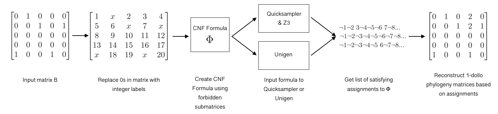

# 1-Dollo Solution Sampler

A tool that samples solutions to the k-Dollo Phylogeny Problem for k = 1, a variant of the Two State Perfect Phylogeny Problem in which we are trying to infer a character-based phylogenetic tree T where each character is gained once and can be lost at most once.



## Requirements

This repository uses two SAT Solution samples: [QuickSampler](https://github.com/RafaelTupynamba/quicksampler) and [UniGen](https://bitbucket.org/kuldeepmeel/unigen/src/master/). QuickSampler also requires the z3 binary specified in the installation instructions.

All of these binaries should be provided, but if none of them work, please see the GitHub pages for further instructions.

## Usage Instructions

### Generating 1-dollo phylogenies for a given input matrix using QuickSampler

Run with:

```
python3 generate_samples.py --filename=INPUT_MATRIX_FILENAME --outfile=SOLUTIONS_OUTFILE --num_samples=NUMBER_OF_SAMPLES --sampler=SAMPLER_TYPE
```

This will sample NUMBER_OF_SAMPLES 1-dollo phylogeny matrices for the matrix in INPUT_MATRIX_FILENAME using the sampler of your choosing and save the reconstructed 1-dollo matrices to SOLUTIONS_OUTFILE.

SAMPLER_TYPE can either be 1 for Quicksampler or 2 for Unigen. Note that Unigen is not Mac compatible.

### Generating CNF formulae

Run with:

```
python3 generate_formula.py --filename=INPUT_MATRIX_FILENAME --outfile=SOLUTION_FILENAME
```

This takes in a matrix specified in INPUT_MATRIX_FILENAME and writes the cnf formula to SOLUTION_FILENAME

### Generating all 1-Dollo phylogenies

Run with:

```
python3 brute_force_solver.py --matrixfilename=INPUT_MATRIX_FILENAME --solutionfilename=SOLUTION_FILENAME
```

This takes in a matrix specified in INPUT_MATRIX_FILENAME and writes all 1-Dollo phylogenies to SOLUTION_FILENAME. The solutions written to SOLUTION_FILENAME will be in compressed format, where each line represents a satisfying assignment to the boolean formula generated for the input matrix. Each character in the line corresponds to a 0 in the input matrix, which can either stay a 0 (character is 0) or be flipped to a 1.

### Generating Metrics

Run with:

```
python3 generate_metrics.py --directory=DIRECTORY --quantity=NUMBER_OF_FILES --outfile=METRICS_OUTFILE --num_samples=NUMBER_OF_SAMPLES
```

This takes NUMBER_OF_FILES files from the DIRECTORY, and generates a cnf formula, then samples NUMBER_OF_SAMPLES each from UniGen and QuickSampler. All of the compiled data is written to METRICS_OUTFILE. As data is generated, the amount of total solutions is saved to `total_solutions.csv` in order to speed up the process on further runs.