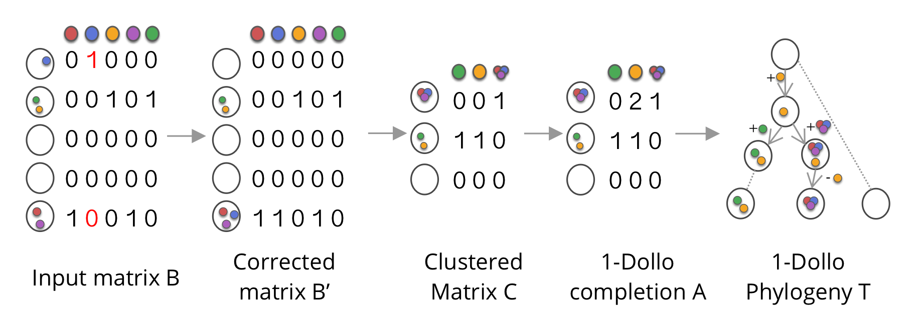
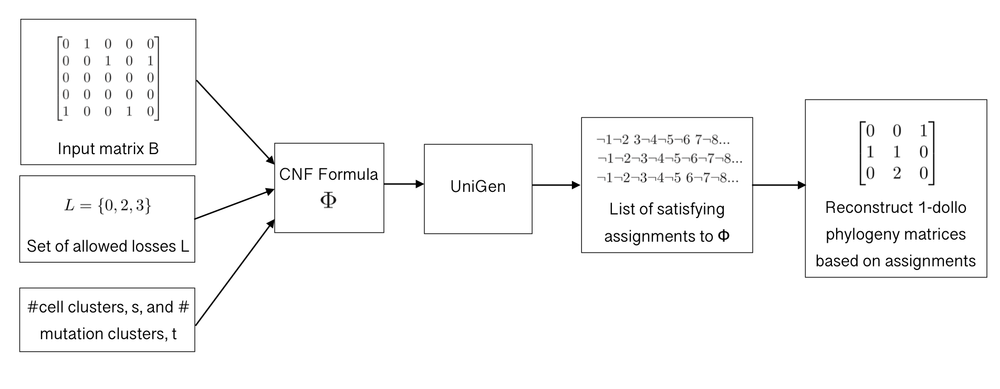

# DolloSAT

A method that samples solutions to the k-Dollo Phylogeny Problem for k = 1, a variant of the Two State Perfect Phylogeny Problem in which we are trying to infer a character-based phylogenetic tree T where each character is gained once and can be lost at most once.




## Requirements

This repository uses [UniGen](https://bitbucket.org/kuldeepmeel/unigen/src/master/), a near uniform SAT sampler. The UniGen binary is provided in the samplers directory, but please see the GitHub page if you're having issues any issues with it. UniGen is not Mac compatible.

## Usage Instructions

### Generating 1-dollo phylogenies for a given input matrix using QuickSampler

Run with:

```
python3 generate_samples.py [-h] [--filename FILENAME] [--outfile OUTFILE]
                           [--timeout TIMEOUT] [--num_samples NUM_SAMPLES]
                           [--s S] [--t T] [--fn FALSE_NEGATIVES]
                           [--fp FALSE_POSITIVES] [--allowed_losses ALLOWED_LOSSES]
                           [--debug]
```

This will attempt to sample NUMBER_OF_SAMPLES 1-dollo phylogeny matrices for the matrix in INPUT_MATRIX_FILENAME using the sampler of your choosing, where only mutations specified in LOSSES_FILENAME can be lost. The solutions will contain exactly FALSE_NEGATIVES false negatives and exactly FALSE_POSITIVES false positives.

The reconstructed 1-dollo matrices will be saved to SOLUTIONS_OUTFILE.

SAMPLER_TYPE can either be 1 for Quicksampler or 2 for Unigen. Note that Unigen is not Mac compatible.

### Generating CNF formulae

Run with:

```
python3 generate_formula.py [-h] [--filename FILENAME] [--outfile OUTFILE]
                           [--s S] [--t T] [--fn FN] [--fp FP]
                           [--sampler SAMPLER]
                           [--allowed_losses ALLOWED_LOSSES]
```

Generates a boolean formula whose solutions describe 1-dollo phylogeny matrices for the matrix in INPUT_MATRIX_FILENAME where only mutations specified in LOSSES_FILENAME can be lost. Valid assignments to this formula will contain exactly FALSE_NEGATIVES false negatives and exactly FALSE_POSITIVES false positives.
