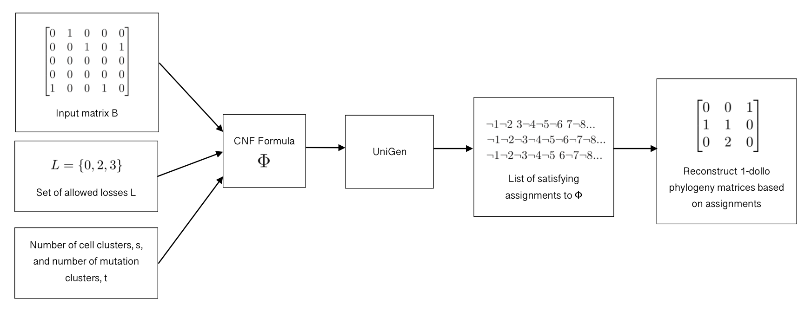

# 1-Dollo Solution Sampler

A tool that samples solutions to the k-Dollo Phylogeny Problem for k = 1, a variant of the Two State Perfect Phylogeny Problem in which we are trying to infer a character-based phylogenetic tree T where each character is gained once and can be lost at most once.



## Requirements

This repository uses two SAT Solution samples: [QuickSampler](https://github.com/RafaelTupynamba/quicksampler) and [UniGen](https://bitbucket.org/kuldeepmeel/unigen/src/master/). QuickSampler also requires the z3 binary specified in the installation instructions. It also uses [pblib](http://tools.computational-logic.org/content/pblib.php), a a toolkit for encoding Pseudo-Boolean constraints into CNF.

All of these binaries should be provided, but if some don't work, please see the links for further instructions.

## Usage Instructions

### Generating 1-dollo phylogenies for a given input matrix using QuickSampler

Run with:

```
python3 generate_samples.py [-h] [--filename FILENAME] [--outfile OUTFILE]
                           [--timeout TIMEOUT] [--num_samples NUM_SAMPLES]
                           [--sampler SAMPLER] [--s S] [--t T] [--fn FALSE_NEGATIVES]
                           [--fp FALSE_POSITIVES] [--allowed_losses ALLOWED_LOSSES]
                           [--debug]
```

This will attempt to sample NUMBER_OF_SAMPLES 1-dollo phylogeny matrices for the matrix in INPUT_MATRIX_FILENAME using the sampler of your choosing, where only mutations specified in LOSSES_FILENAME can be lost. The solutions will contain exactly FALSE_NEGATIVES false negatives and exactly FALSE_POSITIVES false positives.

The reconstructed 1-dollo matrices will be saved to SOLUTIONS_OUTFILE.

SAMPLER_TYPE can either be 1 for Quicksampler or 2 for Unigen. Note that Unigen is not Mac compatible.

### Generating CNF formulae

Run with:

```
python3 generate_formula.py [-h] [--filename FILENAME] [--outfile OUTFILE]
                           [--s S] [--t T] [--fn FN] [--fp FP]
                           [--sampler SAMPLER]
                           [--allowed_losses ALLOWED_LOSSES]
```

Generates a boolean formula whose solutions describe 1-dollo phylogeny matrices for the matrix in INPUT_MATRIX_FILENAME where only mutations specified in LOSSES_FILENAME can be lost. Valid assignments to this formula will contain exactly FALSE_NEGATIVES false negatives and exactly FALSE_POSITIVES false positives.


### Generating all 1-Dollo phylogenies - under construction

Run with:

```
python3 brute_force_solver.py --matrixfilename=INPUT_MATRIX_FILENAME
                                --solutionfilename=SOLUTION_FILENAME
                                --s=NUM_CELL_CLUSTERS
                                --t=NUM_MUTATION_CLUSTERS
```

This takes in a matrix specified in INPUT_MATRIX_FILENAME and writes all 1-Dollo phylogenies to SOLUTION_FILENAME. The solutions written to SOLUTION_FILENAME will be in compressed format, where each line represents a satisfying assignment to the boolean formula generated for the input matrix. Each character in the line corresponds to a 0 in the input matrix, which can either stay a 0 (character is 0) or be flipped to a 1.

### Generating Metrics - under construction

Run with:

```
python3 generate_metrics.py --directory=DIRECTORY
                            --quantity=NUMBER_OF_FILES
                            --outfile=METRICS_OUTFILE
                            --samples=NUMBER_OF_SAMPLES
```

This takes NUMBER_OF_FILES files from the DIRECTORY, and generates a cnf formula, then samples NUMBER_OF_SAMPLES each from UniGen and QuickSampler. All of the compiled data is written to METRICS_OUTFILE. As data is generated, the amount of total solutions is saved to `total_solutions.csv` in order to speed up the process on further runs.